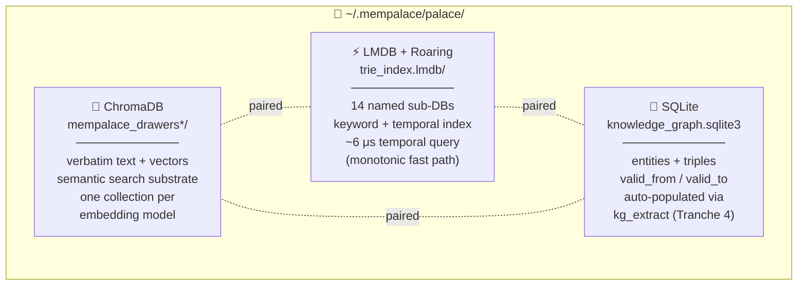
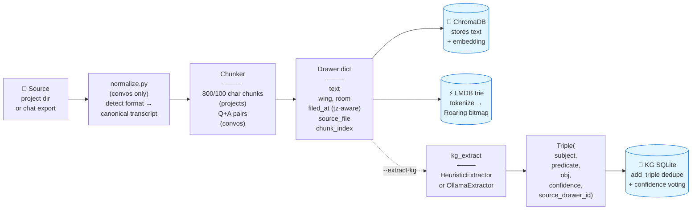
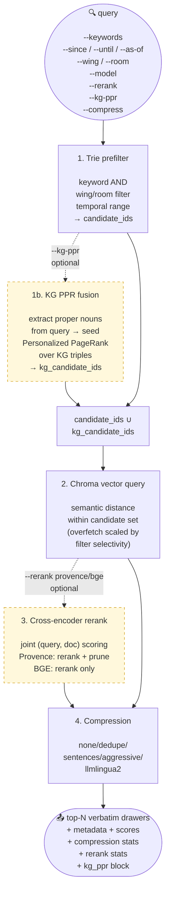
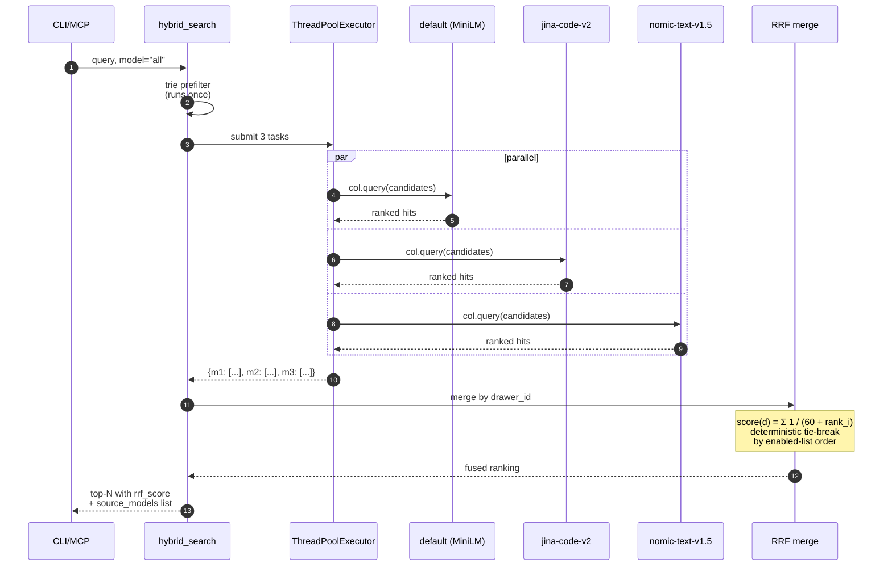
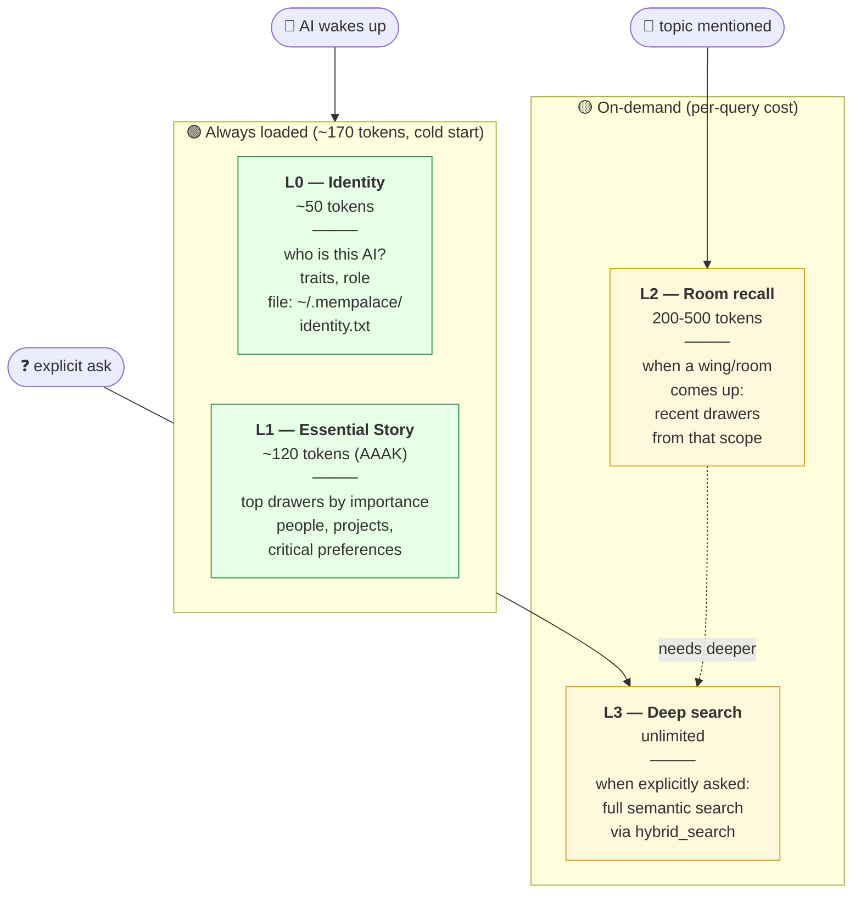
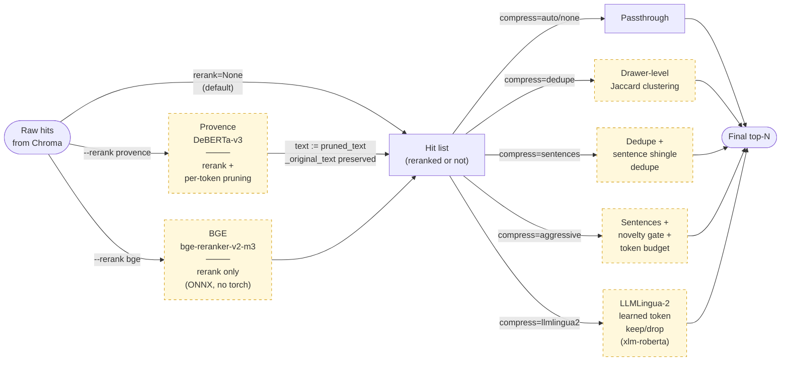
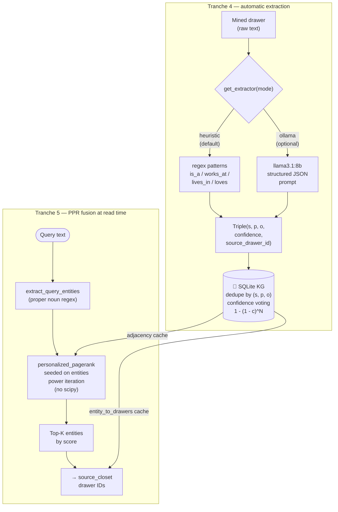
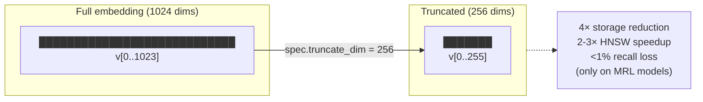
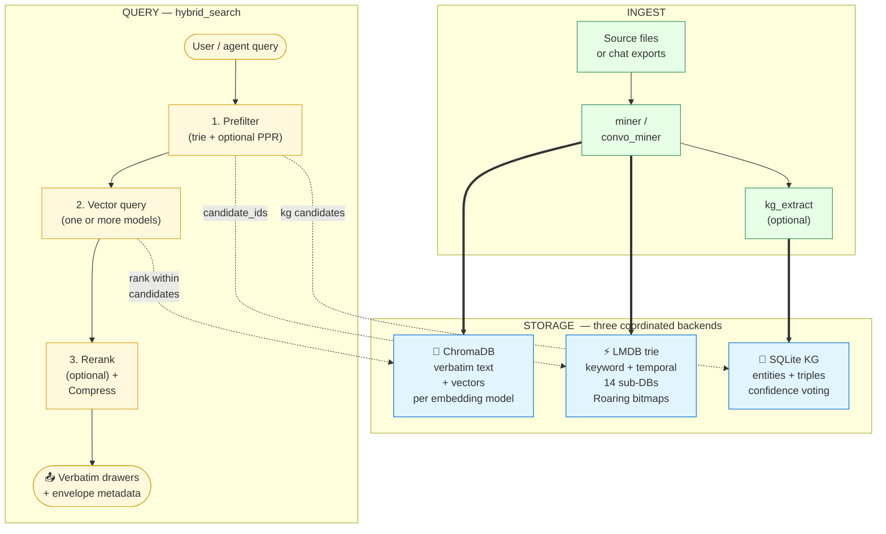

# MemPalace Architecture — Visual Reference

A single page to see how everything fits together. Every diagram on
this page is a live Mermaid block that renders inline on GitHub and
in most Markdown editors. Text fallbacks live alongside each diagram
so the doc is still useful in a plain terminal.

Jump to a section:

1. [The three storage backends](#1-the-three-storage-backends)
2. [Mining data flow](#2-mining-data-flow)
3. [Hybrid search pipeline](#3-hybrid-search-pipeline)
4. [Multi-model fan-out with RRF](#4-multi-model-fan-out-with-rrf)
5. [The 4-layer memory stack](#5-the-4-layer-memory-stack)
6. [The palace hierarchy](#6-the-palace-hierarchy)
7. [Reranking + compression stage](#7-reranking--compression-stage)
8. [KG extraction + PPR fusion](#8-kg-extraction--ppr-fusion)
9. [Matryoshka truncation](#9-matryoshka-truncation)
10. [Full system at a glance](#10-full-system-at-a-glance)

---

## 1. The three storage backends

Every palace is **three** coordinated stores living side-by-side in
one directory. Writes go to all three (or two, depending on the
write path); reads compose signals from all three:



**Plain-text view:**

```
~/.mempalace/palace/
├── mempalace_drawers/              ← ChromaDB (default model)
├── mempalace_drawers__jina_code_v2/ ← ChromaDB (optional model)
├── mempalace_drawers__nomic_text_v1_5/
├── trie_index.lmdb/                ← LMDB environment with 14 sub-DBs
└── knowledge_graph.sqlite3         ← entities + triples
```

Each backend is authoritative for a different kind of query:

| Backend | Owns | Queried for |
|---|---|---|
| ChromaDB | verbatim text + dense vectors | semantic relevance |
| LMDB trie | inverted index + temporal + wing/room | keyword, recency, scope |
| SQLite KG | typed relationships + temporal validity | facts about entities, PPR |

**Why three?** No single data structure is good at all three query
shapes. Vector stores are great at "find something that _means_ this"
but terrible at "find things from last Tuesday"; inverted indexes
are the reverse; knowledge graphs can answer "who is Alice's
manager _as of_ 2024-03" that neither can. MemPalace keeps the three
as separate optimized stores and blends the signals in
[`searcher.hybrid_search`](../mempalace/searcher.py).

---

## 2. Mining data flow

What happens when you run `mempalace mine <dir>`:



Every drawer writes to **Chroma + trie** unconditionally. KG
extraction is opt-in via `--extract-kg` — see
[`docs/KG_EXTRACTION.md`](KG_EXTRACTION.md) for the two extractor
paths (heuristic / Ollama).

**Key tuning constants** (all in `mempalace/miner.py` and
`mempalace/convo_miner.py`):

| Constant | Value | Purpose |
|---|---|---|
| `CHUNK_SIZE` | 800 chars | target chunk length for projects |
| `CHUNK_OVERLAP` | 100 chars | context bleed between adjacent chunks |
| `MIN_CHUNK_SIZE` | 50 chars | skip anything smaller |
| `ROOM_DETECTION_WINDOW` | 2000 / 3000 chars | header text scanned for room inference |
| `MAX_AI_LINES_PER_TURN` | 8 lines | ceiling per AI reply in a Q+A pair |

---

## 3. Hybrid search pipeline

The default path is zero-cost: pure semantic search with none of the
optional stages enabled. Every arrow that says **optional** is a
knob the user can turn on individually.



The four main stages are all **independent** — turning any of them
off drops back to the exact behavior of the previous tranche.
Stage 1 always runs (but returns the full set if no filters were
given). Stages 1b, 3, and the non-default compression modes are
opt-in.

---

## 4. Multi-model fan-out with RRF

`mempalace search --model all` runs every enabled embedding model's
collection concurrently, then merges the result lists with Reciprocal
Rank Fusion (`k = 60`). Parallel execution turns an N-model fan-out
into roughly `max(per-model-latency)` instead of `sum(per-model-latency)`:



**RRF formula** from
[`mempalace/searcher.py:_hybrid_search_fan_out`](../mempalace/searcher.py):

```
                      N
                     ___
                     ╲        1
       score(d)  =   ╱   ─────────
                     ‾‾‾   k + rank_i
                    i = 1

       k = 60  (Cormack / Clarke / Buettcher paper, 2009)
```

A drawer that surfaces at rank 0 in two models scores
`1/60 + 1/60 ≈ 0.033`; one that surfaces only in a single model at
rank 5 scores `1/65 ≈ 0.0154`. The more models that agree on a
drawer, the higher its fused rank.

See [`docs/MODEL_SELECTION.md`](MODEL_SELECTION.md) for per-model
install instructions.

---

## 5. The 4-layer memory stack

Your AI doesn't load the whole palace on startup. It loads 170 tokens
of identity + critical facts and queries deeper layers on demand:



Implementation in [`mempalace/layers.py`](../mempalace/layers.py).
`mempalace wake-up` prints L0 + L1 — paste it into a local LLM's
system prompt, or let the MCP server deliver it via
`mempalace_status`.

---

## 6. The palace hierarchy

The spatial metaphor MemPalace borrows from ancient method-of-loci
memorization: your memories live in **wings** connected by **halls**
and **tunnels**, with **rooms** as specific topics, **closets** as
summaries, and **drawers** as verbatim content.

```mermaid
graph TB
    Palace(["🏛️ Palace"])
    Palace --> W1["🪽 wing_kai<br/>(person)"]
    Palace --> W2["🪽 wing_driftwood<br/>(project)"]
    Palace --> W3["🪽 wing_ai_research<br/>(topic)"]

    W1 --> R1["📂 room<br/>auth-migration"]
    W1 --> R2["📂 room<br/>onboarding"]

    W2 --> R3["📂 room<br/>auth-migration"]
    W2 --> R4["📂 room<br/>ci-pipeline"]

    W3 --> R5["📂 room<br/>colbert-v2"]

    R1 --> D1["🗃️ drawer<br/>(verbatim text)"]
    R3 --> D2["🗃️ drawer<br/>(verbatim text)"]
    R4 --> D3["🗃️ drawer<br/>(verbatim text)"]

    R1 -.->|"tunnel<br/>same room<br/>across wings"| R3

    R1 ===|"hall_events<br/>within wing"| R2
    R3 ===|"hall_facts<br/>within wing"| R4

    classDef wing fill:#e1f5ff,stroke:#0066cc
    classDef room fill:#fff8dc,stroke:#d4a017
    classDef drawer fill:#f0f0f0,stroke:#666
    class W1,W2,W3 wing
    class R1,R2,R3,R4,R5 room
    class D1,D2,D3 drawer
```



Legend:

- **Wing** (`wing_*`) — top-level partition, usually a person or project
- **Room** (`hyphenated-slug`) — named idea within a wing
- **Hall** (`hall_*`) — memory type (facts/events/discoveries/preferences/advice); **connects rooms within one wing**
- **Tunnel** — same room appearing in two wings; computed on-the-fly by `palace_graph.find_tunnels`
- **Closet** — summary pointing at a drawer (v3 keeps closets plain-text; AAAK closets are on the roadmap)
- **Drawer** — the individual ChromaDB document = verbatim chunk

Every drawer carries `wing`, `room`, `source_file`, `chunk_index`,
`added_by`, and `filed_at` in its metadata. That's enough to
reconstruct the full hierarchy from any one drawer.

---

## 7. Reranking + compression stage

The final stage of the search pipeline is a two-step funnel that
runs over whatever the vector query produced. Both steps are
optional; the default is pure passthrough.



See [`docs/RERANKING.md`](RERANKING.md) for the reranker decision
table and install instructions.

---

## 8. KG extraction + PPR fusion

MemPalace's knowledge graph used to be a manual-only surface. With
Tranche 4 + 5, two things changed: (a) the KG can be auto-populated
from mined drawer text, and (b) the KG contributes candidates to the
search result set via Personalized PageRank.



The extraction pipeline is idempotent: re-running
`mempalace kg-extract` on the same palace merges new evidence into
existing triples instead of duplicating them. See
[`docs/KG_EXTRACTION.md`](KG_EXTRACTION.md) and
[`docs/KG_PPR.md`](KG_PPR.md) for the detailed flows.

---

## 9. Matryoshka truncation

Matryoshka Representation Learning trains the embedding model so
the **first N dimensions** of every vector are independently usable
with minimal recall loss. Slicing at read and write time shrinks
storage and query cost proportionally:



**Works on:** `nomic-text-v1.5`, `mxbai-large`, `bge-m3`, both
Ollama models. **Does not work on:** `default`, `jina-code-v2`,
`bge-small-en` — their training didn't use MRL and truncating
corrupts the vector. MemPalace refuses to truncate a non-MRL spec
with a `ValueError`.

| Native dim | Truncate to | Storage | Recall loss |
|---|---|---|---|
| 768 | 256 | ÷3 | &lt;1% |
| 768 | 128 | ÷6 | ~2-3% |
| 1024 | 512 | ÷2 | &lt;1% |
| 1024 | 256 | ÷4 | ~1% |

---

## 10. Full system at a glance

All the boxes on one page. Read it top-to-bottom as the lifecycle of
a single drawer from ingest to retrieval:



### Where everything lives in code

| Concern | File | Entry point |
|---|---|---|
| Mining (projects) | `mempalace/miner.py` | `mine()` |
| Mining (convos) | `mempalace/convo_miner.py` | `mine_convos()` |
| Chat format detection | `mempalace/normalize.py` | `normalize()` |
| Trie index (LMDB + Roaring) | `mempalace/trie_index.py` | `TrieIndex.add_drawer()` / `.keyword_search()` |
| Knowledge graph | `mempalace/knowledge_graph.py` | `KnowledgeGraph.add_triple()` / `.query_entity()` |
| Hybrid search | `mempalace/searcher.py` | `hybrid_search()` |
| Multi-model fan-out | `mempalace/searcher.py` | `_hybrid_search_fan_out()` |
| Embedding registry | `mempalace/embeddings.py` | `list_specs()` / `load_embedding_function()` |
| Reranker registry | `mempalace/rerank.py` | `list_reranker_specs()` / `load_reranker()` |
| Result-set compression | `mempalace/compress.py` | `compress_results()` |
| KG auto-extraction | `mempalace/kg_extract.py` | `get_extractor()` / `extract_from_palace()` |
| KG PPR fusion | `mempalace/kg_ppr.py` | `kg_ppr_candidates()` |
| MCP server | `mempalace/mcp_server.py` | `TOOLS` dict |
| Layer 0 / 1 wake-up | `mempalace/layers.py` | `MemoryStack.wake_up()` |
| 4-layer stack | `mempalace/layers.py` | `Layer0` / `Layer1` / `Layer2` / `Layer3` |
| Palace open seam | `mempalace/palace_io.py` | `open_collection()` |
| AAAK dialect | `mempalace/dialect.py` | `Dialect.compress()` |
| Palace graph | `mempalace/palace_graph.py` | `find_tunnels()` / `traverse()` |
| Entity detection | `mempalace/entity_detector.py` | `detect_entities()` |
| Spellcheck | `mempalace/spellcheck.py` | `spellcheck_user_text()` |

### Related docs

- [`README.md`](../README.md) — quick start, user-facing intro
- [`docs/MODEL_SELECTION.md`](MODEL_SELECTION.md) — seven embedding models + install guide
- [`docs/RERANKING.md`](RERANKING.md) — Provence and BGE reranker details
- [`docs/KG_EXTRACTION.md`](KG_EXTRACTION.md) — heuristic and Ollama triple extraction
- [`docs/KG_PPR.md`](KG_PPR.md) — HippoRAG-style PageRank fusion
- [`CLAUDE.md`](../CLAUDE.md) — developer guide for future Claude Code sessions
- [`CONTRIBUTING.md`](../CONTRIBUTING.md) — contribution rules

---

> **Diagram rendering note**: this file uses Mermaid blocks that render
> inline on GitHub, in VS Code's built-in Markdown preview (with the
> Markdown Preview Mermaid extension), in Obsidian, and in most modern
> documentation sites. In plain-text readers (terminals, `cat`,
> `less`), the diagrams appear as readable text blocks with labels
> and arrows — every diagram on this page is accompanied by a table
> or prose fallback so no viewer is left guessing.
