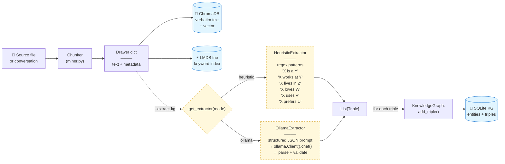
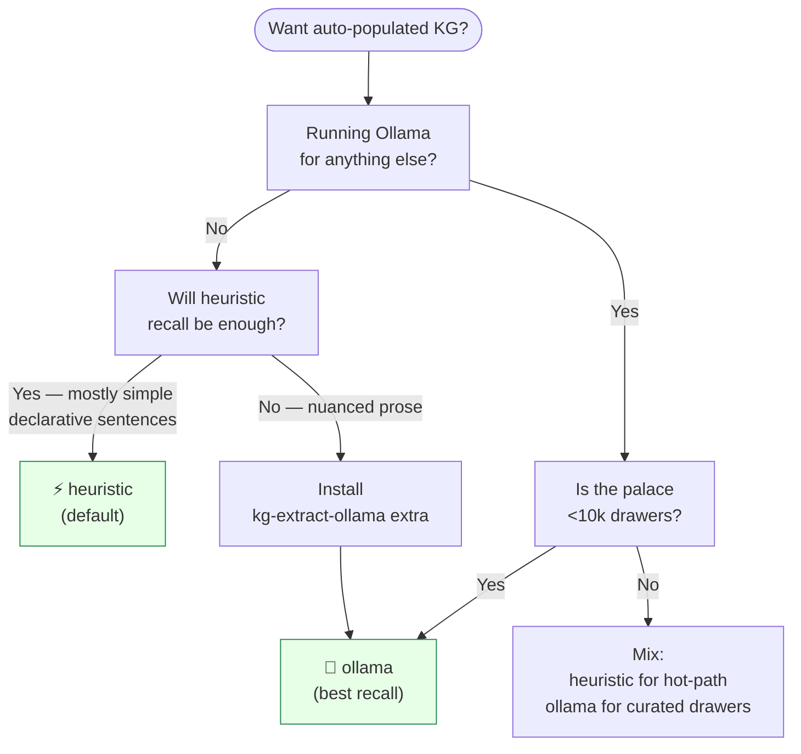
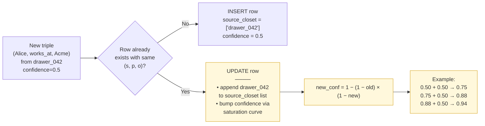
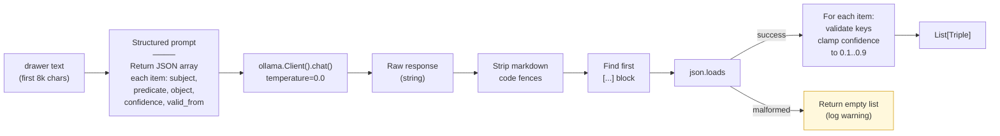

# Automatic Knowledge Graph Extraction

Every MemPalace install ships with a temporal knowledge graph
(SQLite), but until Tranche 4 the only way to put facts into it was
to manually call `mempalace_kg_add` from an MCP client. **Automatic
extraction** closes that gap: every mined drawer can now contribute
typed `(subject, predicate, object)` triples to the KG with zero
manual intervention.

Two extraction paths ship in parallel:

- **Heuristic** — regex patterns, zero new dependencies, ships with
  the core install. Catches ~30-50% of relations at ~50 μs per
  drawer.
- **Ollama** — local LLM (llama3.1:8b by default), optional extra
  (`kg-extract-ollama`). Catches ~80% of relations at ~50-500 ms per
  drawer.

Both paths share the same `Triple` dataclass, the same dedupe +
confidence-voting path, and the same integration point in the
miner. Users pick per-mine with a flag.

## Quick start

```bash
# Mine with heuristic extraction (zero new deps)
mempalace mine ~/projects/mycode --extract-kg

# Mine with Ollama extraction (requires the extra + ollama serve)
pip install 'mempalace[kg-extract-ollama]'
ollama pull llama3.1:8b
ollama serve &
mempalace mine ~/projects/mycode --extract-kg --kg-extract-mode ollama

# Retroactively populate the KG on an already-mined palace
mempalace kg-extract --mode heuristic
mempalace kg-extract --mode ollama --model qwen2.5:7b
```

## Pipeline overview

The extractor runs **after** each drawer has been written to Chroma
+ trie, so a KG extraction failure never blocks the primary
retrieval path:



**Key invariant**: extraction failures log a warning and the miner
continues with the next drawer. A broken Ollama server, a malformed
LLM response, or a single flaky pattern never blocks a mine.

## Which extractor to pick?



| Feature | Heuristic | Ollama |
|---|---|---|
| **New dependencies** | None | `ollama>=0.3` + a running Ollama server |
| **Per-drawer latency** | ~50 μs | ~50-500 ms (model-dependent) |
| **Recall on simple facts** | ~50% | ~85% |
| **Recall on nuanced prose** | ~20% | ~75% |
| **Relation types caught** | is_a, works_at, lives_in, loves, uses, prefers | Unbounded (LLM decides) |
| **Network access at extract time** | None | Localhost only (Ollama server) |
| **Offline CI-friendly** | ✅ | ⚠️ needs mocked client |
| **Good for...** | Large palaces where throughput matters | Small/curated palaces where recall matters |

## Dedupe + confidence voting

The most interesting part of Tranche 4 isn't the extractors — it's
what happens when the **same triple** is asserted by many drawers.
`KnowledgeGraph.add_triple` (extended in
[`mempalace/knowledge_graph.py`](../mempalace/knowledge_graph.py))
merges evidence instead of inserting duplicates:



**Why a saturation curve instead of average or max?** Averaging
repeats gets you stuck below 1.0 forever; max ignores the *quantity*
of corroborating evidence. The "independent evidence" rule
`1 − (1 − c_old) × (1 − c_new)` asymptotes to 1.0 without reaching
it, which matches how a cautious reader updates their belief after
hearing the same claim from N sources.

### Confidence convergence

```
  confidence
    │
 1.0┤                                              - - - -
    │                                    ───────
    │                           ──────
    │                    ─────
    │              ─────
 0.5┤●───●
    │
    │
 0.0┴────┬────┬────┬────┬────┬────┬────┬────┬────
         1    2    3    4    5    6    7    8
                  evidence count (same c=0.5 each)
```

Every row in the KG stores `source_closet` as a JSON list of drawer
IDs — the voting path migrates legacy bare-string values on first
merge so pre-Tranche-4 palaces keep working.

## Heuristic patterns

The `HeuristicExtractor` in
[`mempalace/kg_extract.py`](../mempalace/kg_extract.py) ships with
six patterns. Each one fires on a simple declarative sentence and
returns a `Triple` with a confidence score calibrated to the
pattern's specificity.

| Pattern | Matches | Predicate | Base confidence |
|---|---|---|---|
| `X is a Y` | "Alice is a doctor." | `is_a` | 0.70 |
| `X works at Y` | "Bob works at Acme Corp." | `works_at` | 0.75 |
| `X lives in Y` | "Max lives in Berlin." | `lives_in` | 0.70 |
| `X loves Y` | "Riley loves chess." | `loves` | 0.60 |
| `X uses Y` | "Alice uses Postgres." | `uses` | 0.50 |
| `X prefers Y` | "Bob prefers Ruby over Python." | `prefers` | 0.60 |

A couple of invariants:

1. **Subject must start with a capital letter.** The regex uses
   `(?-i:...)` to lock the subject group to case-sensitive matching
   even though the verb portion is `re.IGNORECASE`. This rejects
   "the cat is a mammal" without an NLP library.
2. **Object stopwords are filtered.** `a`, `an`, `the`, `this`, and
   the usual pronouns can't be the object of a matched triple.
3. **Entity hints boost confidence.** When the miner passes
   `entity_hints=[...]` (derived from `entity_detector`) and the
   subject appears in that list, the triple's confidence gets
   bumped by +0.15 up to a ceiling of 0.90.
4. **Output is deduped.** If the same `(subject, predicate, object)`
   tuple appears twice in a single drawer, only the
   highest-confidence instance survives.

## Ollama prompt + parser

The `OllamaExtractor` sends a **structured prompt** asking for a
JSON array of triples. The parser tolerates the most common LLM
output sins — markdown code fences, prose wrapping the array,
single objects instead of arrays, trailing commas. Everything that
doesn't fit gracefully falls back to "no triples for this drawer":



**What the prompt demands** (see `_OLLAMA_PROMPT_TEMPLATE`):

```
Extract factual relationships from the text below as a JSON array.

Each item must be an object with exactly these keys:
  subject: the entity doing/being something (short proper noun)
  predicate: the relationship type (snake_case verb)
  object: the entity being connected to (short noun or proper noun)
  confidence: number between 0 and 1 indicating how certain you are
  valid_from: optional ISO date (YYYY-MM-DD or YYYY) if the text
              gives one, else null

Only extract relationships that are explicitly stated.
Do not infer, do not hallucinate.
Return ONLY the JSON array, no prose, no markdown, no code fences.
```

The `temperature=0.0` setting makes the output as deterministic as
the model allows, so repeated runs on the same drawer tend to
produce the same triples.

## Recommended Ollama models

| Model | Pull command | Approx size | Notes |
|---|---|---|---|
| `llama3.1:8b` (default) | `ollama pull llama3.1:8b` | 4.7 GB | Best baseline; good JSON discipline |
| `qwen2.5:7b` | `ollama pull qwen2.5:7b` | 4.7 GB | Slightly better on long prose |
| `mistral:7b` | `ollama pull mistral:7b` | 4.1 GB | Smaller memory footprint |
| `phi3:medium` | `ollama pull phi3:medium` | 7.9 GB | Strong few-shot instruction following |

Any locally-pulled model with reasonable JSON output capability
works. Pick the smallest one that gives you the recall you need.

## Full user journey

End-to-end walkthrough on an already-mined palace:

```bash
# 1. (One-time) install the optional extra if you want Ollama
pip install 'mempalace[kg-extract-ollama]'

# 2. Confirm Ollama is running and has the model
ollama serve &
ollama pull llama3.1:8b

# 3. Retroactively extract triples from every drawer
mempalace kg-extract --mode ollama --model llama3.1:8b

#   Output:
#     Extracting KG triples from /Users/you/.mempalace/palace
#     Mode: ollama (llama3.1:8b)
#
#     Drawers scanned:  1,234
#     Triples added:    2,847
#     Errors:           0

# 4. Query the KG
mempalace wake-up  # shows L0 + L1 — KG is queried by MCP tool_kg_query
```

Or for the fast / zero-dep path:

```bash
mempalace kg-extract --mode heuristic

# Output:
#   Extracting KG triples from /Users/you/.mempalace/palace
#   Mode: heuristic
#
#   Drawers scanned:  1,234
#   Triples added:    612
#   Errors:           0
```

## Troubleshooting

**`Ollama server unreachable at http://localhost:11434`**
Start Ollama and pull the model:
```bash
ollama serve &
ollama pull llama3.1:8b
```

**`The Ollama KG extractor requires the 'ollama' package`**
You forgot the optional extra:
```bash
pip install 'mempalace[kg-extract-ollama]'
```

**`kg-extract says 'Drawers scanned: 0'`**
No palace found. Confirm the path with `mempalace status`.

**`Triples added: 0` after heuristic extraction**
Your drawers don't contain simple declarative sentences matching
the six built-in patterns. Try the Ollama path for richer
extraction, or add new patterns to `HeuristicExtractor` (see
[`mempalace/kg_extract.py`](../mempalace/kg_extract.py)).

**`source_closet` column has legacy single-string rows from before Tranche 4**
The voting path auto-migrates those on first merge — simply
re-running `mempalace kg-extract` once wraps the strings into JSON
lists without losing any data.

## Code map

| Concern | File | Key symbols |
|---|---|---|
| Triple dataclass + extractors | `mempalace/kg_extract.py` | `Triple`, `HeuristicExtractor`, `OllamaExtractor` |
| Extractor factory | `mempalace/kg_extract.py` | `get_extractor(mode, **kwargs)` |
| Palace-wide walker | `mempalace/kg_extract.py` | `extract_from_palace(palace_path, ...)` |
| KG dedupe + voting | `mempalace/knowledge_graph.py` | `KnowledgeGraph.add_triple()`, `_merge_source_closets()` |
| Miner hook | `mempalace/cli.py` | `cmd_mine` post-step on `--extract-kg` |
| Retroactive CLI | `mempalace/cli.py` | `cmd_kg_extract` + `mempalace kg-extract` subcommand |
| Tests | `tests/test_kg_extract.py` | 31 tests covering both paths |

## See also

- [`docs/ARCHITECTURE.md`](ARCHITECTURE.md) — full system overview
- [`docs/KG_PPR.md`](KG_PPR.md) — the HippoRAG-style PPR fusion
  layer that consumes these triples at read time
- [`docs/MODEL_SELECTION.md`](MODEL_SELECTION.md) — embedding
  model selection (separate but related optional extras)
