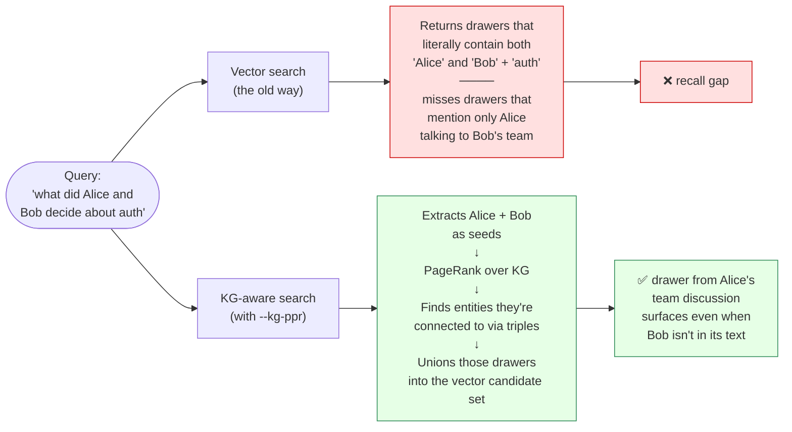
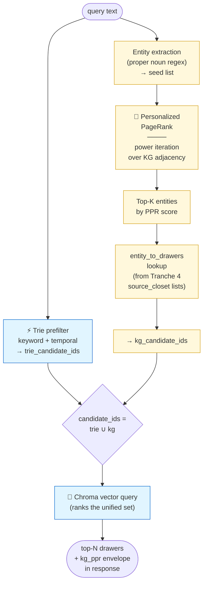
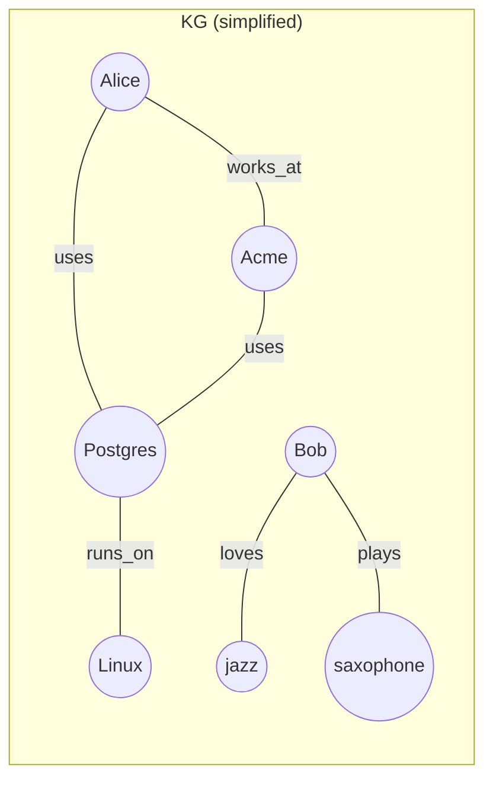
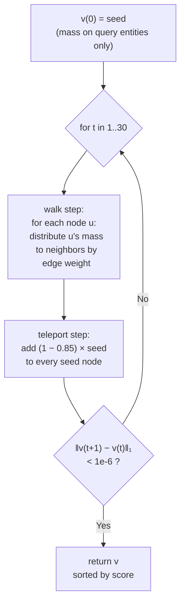

# HippoRAG-style PageRank fusion

MemPalace's knowledge graph was a **parallel read-only surface**
until Tranche 5 — you could query it via `tool_kg_query`, but
`searcher.hybrid_search` didn't consult it. The PPR fusion layer
(inspired by [HippoRAG](https://arxiv.org/abs/2405.14831),
Gutiérrez et al., NeurIPS 2024) turns the KG into a first-class
retrieval signal. HippoRAG reports up to **+20% recall** on
multi-hop QA over non-graph baselines, specifically on queries
where the answer spans multiple drawers connected by named entities.

Enable it with a single flag:

```bash
mempalace search "what did Alice and Bob decide about auth" --kg-ppr
```

**Depends on Tranche 4**: PPR is only useful when the KG contains
triples. Populate the KG first with
[`docs/KG_EXTRACTION.md`](KG_EXTRACTION.md).

## The core idea

Traditional RAG retrieves candidates purely by vector distance.
When a query mentions two entities that rarely co-occur in any
single drawer, the vector store has no way to know the drawers are
*related*. A knowledge graph does — every triple you extracted in
Tranche 4 is an explicit relationship the vector store can't see.



## Pipeline overview

PPR fusion is a **candidate union** step that runs in parallel with
the trie prefilter. Both contribute drawer IDs; their union feeds
the Chroma vector query:



The Chroma vector query still does the final semantic ranking, so
drawers that look relevant to the query text win regardless of
whether they arrived via the trie or the PPR path. PPR only
**expands the pool of candidates**; it doesn't reorder them itself.

## How Personalized PageRank works

Classic PageRank finds the "most important" node in a graph. The
**personalized** variant biases the random walk toward a small set
of seed nodes, so the highest-scoring nodes are the ones *closest
to your seeds* — exactly what we want for retrieval.



Say the query is **"what does Alice use at work"**. Query entity
extraction finds `["alice"]`. PPR seeds 100% of the mass on
`alice`:

```
Iteration 0:    alice: 1.0    everyone else: 0.0
Iteration 1:    alice: 0.15   acme: 0.38       (teleport 15% back to seed,
                              postgres: 0.38    85% walks to neighbors)
                              others: 0.0
Iteration 2:    alice: 0.48   acme: 0.23
                              postgres: 0.30
                              linux: 0.10
                              others: 0.0
...converges after ~8 iterations
```

The disconnected **bob / jazz / saxophone** component gets zero
mass — PPR respects the graph topology, so a query about Alice
never surfaces Bob's drawers unless the two components are
bridged by some triple.

**Why undirected edges?** The implementation treats every triple as
bidirectional for PPR scoring. If Alice `works_at` Acme, a query
about Alice should surface drawers about Acme *and* a query about
Acme should surface drawers about Alice. HippoRAG does the same.

## Power iteration math

The implementation in
[`mempalace/kg_ppr.py`](../mempalace/kg_ppr.py) is a hand-rolled
power iteration — no scipy, no numpy, pure Python over a sparse
adjacency dict. For personal-scale KGs (100-1000 triples) it
converges in under a millisecond.

At each step `t`:

```
  v(t+1)  =  damping × W · v(t)  +  (1 − damping) × seed
```

where:

- `v(t)` — score vector at step t (dict of `entity_id → float`)
- `W` — row-normalized undirected adjacency (confidence-weighted)
- `damping` — 0.85, the Page/Brin default
- `seed` — uniform mass over query seeds, zero elsewhere



**Key design decisions:**

- **Edge weights = triple confidence.** High-confidence triples
  (evidence-heavy after Tranche 4 voting) propagate more mass, so
  the KG's own quality signal bleeds directly into retrieval.
- **Dangling nodes teleport to seed.** Any node whose neighbors
  all got dropped (e.g., an isolated entity) sends its mass back
  to the seed distribution — the standard PageRank fix.
- **Self-loops dropped.** A triple `(X, rel, X)` would create a
  degenerate stationary distribution on X, so the adjacency
  builder filters them.
- **Cached by mtime.** The adjacency dict is built once per KG
  file mtime and reused across queries. New extraction runs
  invalidate the cache on next access.

## The kg_ppr_candidates envelope

`searcher.hybrid_search` calls
[`kg_ppr.kg_ppr_candidates`](../mempalace/kg_ppr.py) which returns
a structured envelope so the response can surface everything for
debugging:

```python
{
    "seeds": ["alice", "bob"],           # entities found in query + KG
    "top_entities": [                    # highest-scoring nodes
        ("acme", 0.234),
        ("postgres", 0.189),
        ("linux", 0.087),
    ],
    "drawer_ids": {...},                 # set of drawer IDs to union
    "skipped_reason": None,              # or "no_kg", "no_seeds_in_graph"
}
```

Possible `skipped_reason` values:

| Reason | When | What happens |
|---|---|---|
| `None` | PPR ran successfully | Candidates union into the vector query |
| `no_entities_in_query` | No proper nouns found | PPR skipped, pure vector search |
| `no_kg` | KG file missing or empty | PPR skipped, pure vector search |
| `no_seeds_in_graph` | Query entities aren't in the KG | PPR skipped, pure vector search |
| `ppr_returned_empty` | Power iteration found no neighbors | PPR skipped, pure vector search |
| `error: ...` | Any runtime exception | PPR skipped, warning logged |

Every case degrades **gracefully to pure vector search** — PPR
fusion is purely additive, never subtractive.

## When to enable `--kg-ppr`

| Scenario | PPR benefit |
|---|---|
| Query mentions 2+ proper nouns that might be related | 🟢 Strong |
| Query is a single-word noun ("auth") | 🔴 None (no seeds) |
| Your KG is empty | 🔴 None (no_kg) |
| Multi-hop reasoning ("what decisions did Alice's team make") | 🟢 Strong |
| Exact fact lookup ("Alice's email address") | 🟡 Marginal |
| Broad semantic search ("good weather today") | 🔴 None |

Rule of thumb: enable PPR when your query mentions **specific
people or projects** and you expect the answer to span drawers.
Leave it off for broad topic searches or single-entity fact
lookups.

## Full usage

### CLI

```bash
# Populate the KG first (if you haven't already)
mempalace kg-extract --mode heuristic

# Search with PPR fusion
mempalace search "what did Alice and Bob decide about auth" --kg-ppr
```

### MCP

```json
{
  "name": "mempalace_search",
  "arguments": {
    "query": "what did Alice and Bob decide about auth",
    "kg_ppr": true
  }
}
```

### Python

```python
from mempalace.searcher import hybrid_search

result = hybrid_search(
    "what did Alice and Bob decide about auth",
    palace_path="~/.mempalace/palace",
    enable_kg_ppr=True,
)

print(result["kg_ppr"]["seeds"])            # ['alice', 'bob']
print(result["kg_ppr"]["top_entities"][:5]) # top 5 by PPR score
print(result["kg_ppr"]["drawer_id_count"])  # total drawers added by PPR
print(result["kg_ppr"]["skipped_reason"])   # None if PPR ran
```

The `kg_ppr` block in the response envelope is populated on every
search (zero-valued stub when disabled) so clients can uniformly
parse it.

## Graph cache invalidation

The adjacency dict is cached process-wide and invalidated when the
KG file's mtime changes. If you're iterating quickly and want to
force a rebuild:

```python
from mempalace.kg_ppr import clear_cache
clear_cache()
```

This is primarily used by the test suite to reset between temp KGs,
but it's safe to call in production code if you've just run
`mempalace kg-extract` and want the next query to pick up the new
triples immediately (most of the time the mtime check handles it
automatically).

## Code map

| Concern | File | Key symbols |
|---|---|---|
| PPR core | `mempalace/kg_ppr.py` | `personalized_pagerank()` |
| Adjacency loader + cache | `mempalace/kg_ppr.py` | `_CachedGraph`, `_build_adjacency()` |
| Query entity extraction | `mempalace/kg_ppr.py` | `extract_query_entities()` |
| Candidate helper | `mempalace/kg_ppr.py` | `kg_ppr_candidates()` |
| Searcher integration | `mempalace/searcher.py` | `_hybrid_search_single` (enable_kg_ppr) |
| Response envelope serializer | `mempalace/searcher.py` | `_serialize_ppr_envelope()` |
| CLI flag | `mempalace/cli.py` | `--kg-ppr` on `search` subparser |
| MCP schema | `mempalace/mcp_server.py` | `kg_ppr` field on search tools |
| Tests | `tests/test_kg_ppr.py` | 25 tests covering PPR math + fusion |

## See also

- [`docs/KG_EXTRACTION.md`](KG_EXTRACTION.md) — how to populate the
  KG in the first place (prerequisite for PPR)
- [`docs/ARCHITECTURE.md`](ARCHITECTURE.md) — full system
  architecture with the KG integration diagram
- [HippoRAG paper (arXiv 2405.14831)](https://arxiv.org/abs/2405.14831)
  — the research that inspired this feature
- [HippoRAG code (OSU-NLP-Group/HippoRAG)](https://github.com/OSU-NLP-Group/HippoRAG)
