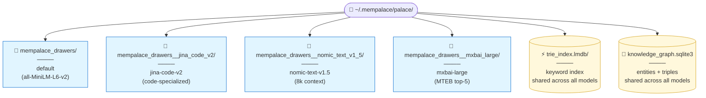
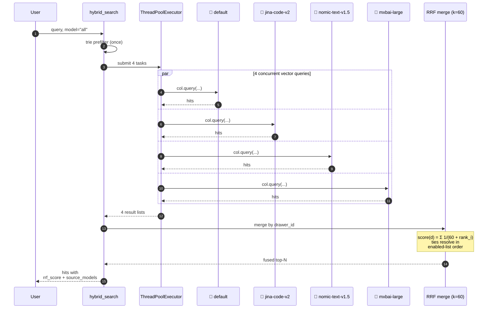
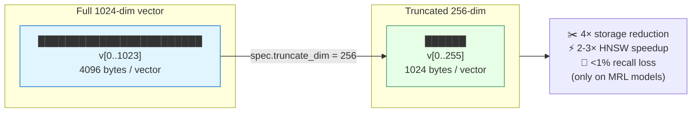

# Choosing an Embedding Model

MemPalace ships **seven embedding models** that coexist side-by-side in
the same palace. The default (`all-MiniLM-L6-v2` built into ChromaDB) is
fine for short English prose and requires zero extra install — but
picking a model that matches your workload can noticeably improve
retrieval quality. This guide shows you which one to pick, how to install
it, and how to mix several at once via Reciprocal Rank Fusion.

## Why model selection matters

The default model is 384-dimensional with a 256-token context window and
was trained on general English. That's a reasonable baseline, but:

- **Source code** (Python, JavaScript, Go, Rust, etc.) has a different
  vocabulary and structure than prose, and the default will miss
  semantic matches that a code-trained model catches.
- **Long LLM conversations** and **decision logs** routinely exceed 256
  tokens per exchange, which means the default silently truncates
  mid-drawer — the trailing half of the conversation never reaches the
  vector.
- **MTEB-proven retrieval quality** is a step up from the default, at
  the cost of pulling torch.

A specialized model lives in its **own ChromaDB collection** inside your
palace directory, so switching models is non-destructive: your existing
`default` collection keeps working, and the new one starts empty until
you mine into it.

## The registry at a glance

Every model is a frozen dataclass in `mempalace/embeddings.py` — these
entries are the authoritative source for everything below.

| Slug | Backend | Dim | Context | MRL | Extras | Description |
|---|---|---|---|---|---|---|
| `default` | `chroma-default` | 384 | 256 | ❌ | _(none)_ | ONNX, built into ChromaDB. Good for short English prose. No extras required. |
| `bge-small-en` | `fastembed` | 384 | 512 | ❌ | `fastembed` | Small general retrieval. Faster and cheaper than the default with marginally better retrieval. |
| `nomic-text-v1.5` | `fastembed` | 768 | 8192 | ✅ | `fastembed` | Ideal for long LLM conversations, decision logs, and architecture docs — the 8k window means no mid-document truncation. |
| `jina-code-v2` | `fastembed` | 768 | 8192 | ❌ | `fastembed` | Trained on CodeSearchNet — strongest small local model for source code retrieval. |
| `mxbai-large` | `sentence-transformers` | 1024 | 512 | ✅ | `sentence_transformers` | MTEB top-5 general retrieval. Drags torch via sentence-transformers. |
| `bge-m3` | `fastembed` | 1024 | 8192 | ✅ | `fastembed` | BAAI multilingual (100+ languages) + 8k context. Unified dense + sparse + multi-vector from one encoder (dense-only mode used here). Strong on MIRACL / MLDR. |
| `ollama-nomic` | `ollama` | 768 | 8192 | ✅ | `ollama` | Uses the locally-running Ollama server. Zero extra downloads if you've already run `ollama pull nomic-embed-text`. |
| `ollama-mxbai` | `ollama` | 1024 | 512 | ✅ | `ollama` | Ollama with `mxbai-embed-large` — 1024-dim retrieval without pulling torch or fastembed. |

**MRL column**: ✅ means the model was trained with Matryoshka
Representation Learning, so you can safely truncate its embeddings to
a smaller dimension (128, 256, 512) for 2-8× storage reduction with
minimal recall loss. See [Matryoshka truncation](#matryoshka-truncation)
below.

## Which model for which job

| I'm working with… | Use | Why |
|---|---|---|
| Short English chat logs, default workload | `default` | Free, bundled, no extras, no downloads |
| Source code (Python / JS / Go / Rust / etc.) | `jina-code-v2` | Trained on CodeSearchNet, 8k context |
| Long LLM conversations / decision logs / architecture docs | `nomic-text-v1.5` | 8k context means no mid-drawer truncation |
| Multilingual content (100+ languages) / long context | `bge-m3` | BAAI multilingual, 8k context, Matryoshka-compatible |
| MTEB-proven quality, torch already installed | `mxbai-large` | Top-5 MTEB, 1024-dim |
| Budget general retrieval (same speed class as default) | `bge-small-en` | Marginally better than default, same cost |
| You already run Ollama for LLM inference | `ollama-nomic` / `ollama-mxbai` | Zero extra downloads, 768-dim / 1024-dim |
| You want the strongest possible retrieval and don't care which model wins | Multiple enabled + `--model all` | RRF fan-out auto-merges + deduplicates (runs queries in parallel) |

## Installing backends

Each backend is an optional pip extra. Install only what you need:

```bash
# fastembed — ONNX, no torch. Unlocks: bge-small-en, nomic-text-v1.5, jina-code-v2
pip install 'mempalace[embeddings-fastembed]'

# sentence-transformers — pulls torch. Unlocks: mxbai-large
pip install 'mempalace[embeddings-sentence-transformers]'

# ollama — tiny HTTP client for a locally-running Ollama server.
# Unlocks: ollama-nomic, ollama-mxbai
# (separately requires `ollama serve` + `ollama pull <model_id>`)
pip install 'mempalace[embeddings-ollama]'

# Everything at once
pip install 'mempalace[embeddings-all]'
```

The core install uses only Chroma's built-in ONNX model and never
touches these extras. You can install one backend now and add more
later without re-mining anything — your existing collections stay put.

## The full user journey

End-to-end walkthrough for mining a code repository with
`jina-code-v2`:

```bash
# 1. Install the backend
pip install 'mempalace[embeddings-fastembed]'

# 2. See every model with install / enable / drawer-count status
mempalace models list

# 3. Eagerly download the model weights (optional but recommended —
#    otherwise the first mine call pays the download cost)
mempalace models download jina-code-v2

# 4. Enable the slug in config.json
mempalace models enable jina-code-v2

# 5. (Optional) Make it the default so --model can be omitted
mempalace models set-default jina-code-v2

# 6. Mine your code repo — writes to the
#    mempalace_drawers__jina_code_v2 collection
mempalace mine ~/projects/mycode --model jina-code-v2

# 7. Search the code-specialized collection
mempalace search "where is auth verified" --model jina-code-v2
```

Want every enabled model to weigh in on each query? See
[Coexistence and fan-out](#coexistence-and-fan-out).

### The `mempalace models` subcommand

```
mempalace models list                    # show all 7 specs + status
mempalace models download <slug>         # eagerly fetch weights
mempalace models enable <slug>           # add to enabled_embedding_models
mempalace models disable <slug>          # remove (cannot disable 'default')
mempalace models set-default <slug>      # set as default for mine/search
```

All four write actions persist to `~/.mempalace/config.json` under the
`default_embedding_model` and `enabled_embedding_models` keys.

## Coexistence and fan-out

### Each model lives in its own collection

The `collection_name_for(slug)` helper in `mempalace/embeddings.py`
maps every slug to a Chroma collection name:

| Slug | Collection |
|---|---|
| `default` | `mempalace_drawers` _(legacy name — unchanged for backward compat)_ |
| `jina-code-v2` | `mempalace_drawers__jina_code_v2` |
| `nomic-text-v1.5` | `mempalace_drawers__nomic_text_v1_5` |
| `bge-small-en` | `mempalace_drawers__bge_small_en` |

The rule: `default` → legacy name, everything else gets the
`mempalace_drawers__` prefix plus a normalized slug where `.` and `-`
become `_`.



**Mining `--model jina-code-v2` never touches the `default`
collection.** Each enabled model adds roughly its own disk footprint on
top of the baseline. The trie index and the knowledge graph are
**shared** across all models — they're embedding-agnostic, so one
keyword search + one PPR run is enough no matter how many embedding
models you have enabled. This is a deliberate design: switching
models is safe, and you can rerun the same query against any of
them without disturbing the others.

### Fan-out with `--model all`

Pass `--model all` to any search command (CLI or MCP) and MemPalace
runs the query against **every slug in `enabled_embedding_models`**,
then merges the results with Reciprocal Rank Fusion:

$$
\text{score}(drawer) = \sum_i \frac{1}{k + \text{rank}_i}
$$

where `k = 60` (from `searcher._RRF_K`, the value from the original
Cormack/Clarke/Buettcher paper) and `rank_i` is the drawer's 0-indexed
position in the i-th model's result list. A drawer that surfaces in
multiple collections contributes from each one and ranks higher
naturally.

**Parallel execution.** Per-model queries run concurrently through a
`ThreadPoolExecutor`, so the wall-clock drops from roughly
`sum(per-model-latency)` to `max(per-model-latency)`:



**Concrete speedup**: with 4 enabled models at ~100 ms each, the
old serial loop took ~400 ms. Parallel drops that to ~100 ms + a
small thread-pool overhead. Configure the pool size via
`config.json` → `fan_out_max_workers` (default 8, capped at
`len(enabled_embedding_models)`).

**Example:**

```bash
# Enable three models
mempalace models enable jina-code-v2
mempalace models enable nomic-text-v1.5
mempalace models enable bge-small-en

# Mine the same repo under each (or different sources — it's up to you)
mempalace mine ~/projects/mycode --model jina-code-v2
mempalace mine ~/chats --mode convos --model nomic-text-v1.5
mempalace mine ~/notes --model bge-small-en

# Fan-out search
mempalace search "what did we decide about auth" --model all
```

The response is a merged top-N list where each hit carries:
- `rrf_score` — the fused RRF score
- `source_models` — which slugs contributed the hit
- `cluster_size` + `variants` — any near-duplicates collapsed into this
  representative

### Auto-deduplication on fan-out

Fan-out automatically upgrades the compression mode from `auto` to
`dedupe` (see `mempalace/compress.py:resolve_auto_mode`), so duplicate
or near-duplicate drawers that surface from multiple models collapse
into single representatives with a cluster size. Pass
`--compress none` explicitly if you want to see every raw hit.

### Writes reject `--model all`

Mining, `tool_add_drawer`, and `tool_diary_write` all reject
`model="all"` — writes need a concrete destination slug. The CLI
exits with code 2 and the MCP tool returns:

```json
{"success": false, "error": "model='all' is read-only; pick a concrete slug."}
```

## The MCP surface

Every search/write MCP tool accepts an optional `model` field. The
`mempalace_list_models` tool returns the full registry so your AI can
pick intelligently.

### `mempalace_list_models` response shape

```json
{
  "models": [
    {
      "slug": "jina-code-v2",
      "display_name": "Jina Embeddings v2 Base Code",
      "description": "768-dim, 8192-token context. Trained on CodeSearchNet — strongest small local model for source code retrieval.",
      "backend": "fastembed",
      "model_id": "jinaai/jina-embeddings-v2-base-code",
      "dimension": 768,
      "context_tokens": 8192,
      "extras_required": ["fastembed"],
      "installed": true,
      "enabled": true,
      "is_default": false,
      "drawers": 1234
    },
    ...
  ],
  "default_model": "default"
}
```

### `model` field on search / write tools

```json
{
  "name": "mempalace_search",
  "arguments": {
    "query": "where is auth verified",
    "model": "jina-code-v2"
  }
}
```

- Omit → use the palace default
- Concrete slug → query only that model's collection
- `"all"` → RRF fan-out (reads only)

## Matryoshka truncation

Models trained with Matryoshka Representation Learning (MRL) produce
embeddings where the first N dimensions are independently usable with
minimal recall loss. This lets you trade a tiny amount of quality for
significant storage and query-speed improvements. The 2024+ models in
the MemPalace registry that support MRL are:
`nomic-text-v1.5`, `mxbai-large`, `bge-m3`, and both Ollama models.



**How to enable it**: add a `truncate_dim` field to the spec at
registration time or construct your own `EmbeddingSpec` with
`truncate_dim=256` (or 128, 512, etc.). Every `__call__` on the
adapter slices each vector before handing it to Chroma, so the stored
vectors and the HNSW index both shrink proportionally.

**Typical tradeoffs** (from the MRL paper and follow-ups):

| Native dim | Truncated to | Storage reduction | Recall loss |
|---|---|---|---|
| 768 | 256 | 3× | &lt;1% |
| 768 | 128 | 6× | ~2-3% |
| 1024 | 512 | 2× | &lt;1% |
| 1024 | 256 | 4× | ~1% |

Attempting to truncate a non-MRL model (e.g. `jina-code-v2` or
`default`) will raise a `ValueError` — truncating a non-MRL embedding
corrupts its similarity structure and would silently tank recall.
The guard lives in `_apply_matryoshka` in
[`mempalace/embeddings.py`](../mempalace/embeddings.py) and fires
before any vector reaches Chroma.

## HNSW tuning

MemPalace ships with `hnsw_ef_search = 40` (up from Chroma's default
of 10). This is a query-time parameter that controls how many
candidates the HNSW graph walker explores before returning the
top-k. Published HNSW practice shows:

| `ef_search` | Typical recall | Latency cost vs ef=10 |
|---|---|---|
| 10 (Chroma default) | ~90% | 1× |
| 40 (MemPalace default) | ~98% | ~3× |
| 80 | ~99% | ~5× |
| 128 | ~99.5% | ~8× |

Absolute latency at `ef=40` is sub-10 ms for palaces up to ~100k
drawers. Users with larger palaces or maximum-recall workloads can
bump it via `config.json`:

```json
{
  "hnsw_ef_search": 80
}
```

Or via env var for a single session:

```bash
MEMPALACE_HNSW_EF_SEARCH=128 mempalace search "hard query"
```

**Note**: `ef_search` only affects collections created *after* the
value is set. To apply a new value to an existing palace, re-create
the collection with `mempalace repair` which rebuilds from the
stored drawers.

## Parallel fan-out

When `--model all` is used, MemPalace runs each enabled model's
query **concurrently** via a thread pool. Wall-clock latency drops
from roughly `sum(per_model_latency)` to `max(per_model_latency)` —
a ~N× speedup for N enabled models. The trie prefilter runs once
before the fan-out because it's embedding-agnostic, so keyword and
temporal constraints cost the same regardless of model count.

The worker pool is capped at `min(fan_out_max_workers, N)` with a
default of 8 workers. Tune via config:

```json
{
  "fan_out_max_workers": 16
}
```

On busy systems or very large palaces you can lower it to avoid
oversubscribing Chroma's SQLite metadata store.

## Troubleshooting

**`ModuleNotFoundError: No module named 'fastembed'`**
You forgot the pip extra. Install it:
```bash
pip install 'mempalace[embeddings-fastembed]'
```

**`Ollama server unreachable at http://localhost:11434`**
The ollama extras installed the Python client, but the actual model
weights live on the Ollama server side. Start it and pull the model:
```bash
ollama serve &
ollama pull nomic-embed-text
```

**Search returns zero hits after switching models**
You mined into a different collection. Each model has its own Chroma
collection, so switching `--model` without re-mining points you at an
empty collection. Either re-mine under the new slug or use
`--model all` to search every collection at once:
```bash
# Option A: re-mine
mempalace mine ~/projects/mycode --model jina-code-v2

# Option B: fan out across every enabled model
mempalace search "<query>" --model all
```

**`mempalace models list` shows `INST=no` for a slug I just installed**
The extras check uses `importlib.util.find_spec` which walks `sys.path`
without importing. If you installed into a venv that isn't currently
active, the check fails. Activate the venv and try again.

## Benchmark honesty

MemPalace's headline **96.6% LongMemEval R@5** was measured with the
**default** model (`all-MiniLM-L6-v2` via Chroma's ONNX). We haven't
yet published a head-to-head per-slug benchmark across all seven
models, so the "which model for which job" guidance above is based on:

- **Training-set intent** — `jina-code-v2` was explicitly trained on
  CodeSearchNet, so it's the right pick for source code.
- **Context window math** — a 256-token window truncates anything
  longer, and most LLM conversations are longer than that, so
  `nomic-text-v1.5` (8192 tokens) is the safe pick for
  long-form content.
- **Third-party MTEB rankings** — `mxbai-large` sits in the top 5 of
  the MTEB retrieval leaderboard at the time of writing.

A proper per-slug LongMemEval / LoCoMo / ConvoMem shootout is on the
roadmap. See [benchmarks/BENCHMARKS.md](../benchmarks/BENCHMARKS.md)
for the numbers we do have.

## Where to look in the code

The entire feature lives in five files, all of which this guide quotes
from. If you want to extend it or understand edge cases:

| Concern | File |
|---|---|
| Model registry + backend adapters | `mempalace/embeddings.py` |
| Collection naming rule | `mempalace/embeddings.py` → `collection_name_for` |
| RRF fan-out semantics (`k=60`, overfetch) | `mempalace/searcher.py` → `_hybrid_search_fan_out` |
| Auto-compression on fan-out | `mempalace/compress.py` → `resolve_auto_mode` |
| Config persistence | `mempalace/config.py` → `save_embedding_config` |
| `mempalace models` subcommand | `mempalace/cli.py` → `cmd_models` |
| MCP tool + response envelope | `mempalace/mcp_server.py` → `tool_list_models` |

The rich per-model blurbs in this guide are copied verbatim from the
`EmbeddingSpec.description` fields in `embeddings.py` so the docs and
the code stay in sync automatically.
