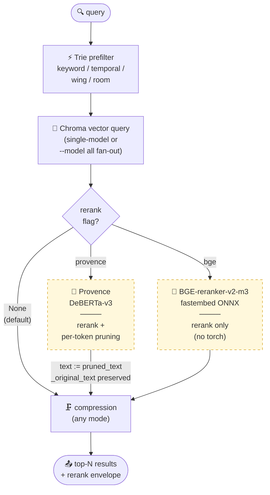
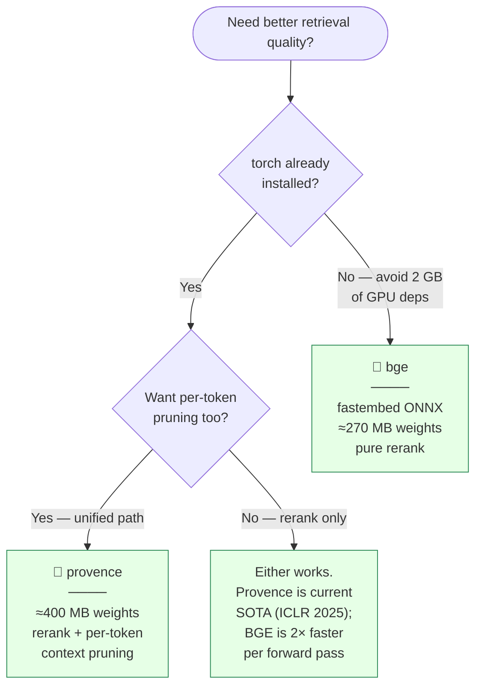

# Cross-encoder reranking

MemPalace's default retrieval path is a **bi-encoder** — the query
and each drawer are embedded independently, then compared by vector
distance. This is fast and scales to millions of drawers, but it's
weaker than **cross-encoders** at judging the fine-grained relevance
of the top ~20-50 candidates to the query.

Reranking adds an optional stage **after** the vector search that
scores each (query, candidate) pair jointly through a small
transformer. Published cross-encoder rerankers routinely add
**+5-10 nDCG points** on BEIR-scale benchmarks compared to bi-encoder
baselines.

MemPalace ships two reranker options, both as **optional pip extras**
— neither is installed or imported by default.

## The two rerankers

| Slug | Model | Backend | Pruning | Torch? | Optional extra |
|---|---|---|---|---|---|
| `provence` | `naver/provence-reranker-debertav3-v1` | `transformers` | ✅ (per-token) | Yes | `rerank-provence` |
| `bge` | `BAAI/bge-reranker-v2-m3` | `fastembed` (ONNX) | ❌ | No | `rerank-bge` |

### Provence — unified reranker + context pruner

**Paper**: Chirkova et al., "Provence: efficient and robust context
pruning for retrieval-augmented generation", ICLR 2025 —
[arXiv 2501.16214](https://arxiv.org/abs/2501.16214)

A single DeBERTa-v3 forward pass per (query, candidate) pair produces
**both** a relevance score **and** a per-token keep/drop label over
the candidate's tokens. The net effect:

1. Ranks the candidates by learned relevance.
2. Drops ~99% of off-topic sentences from each candidate while
   preserving 80-90% of relevant text.

This lets MemPalace unify reranking and context pruning into a
single stage, saving a second model pass. The pruned text flows
through the existing `compress.py` pipeline unchanged — if you also
enable `compress="aggressive"` on top of `rerank="provence"`, the
novelty gate runs over the already-pruned text.

**When to pick Provence**:
- You already have torch installed (from other Python work).
- You want the tightest possible output token budget.
- You care about eliminating repeat sentences across the retrieved
  set in one pass.

**Install**: `pip install 'mempalace[rerank-provence]'`
(pulls `transformers>=4.40` and `torch>=2.2`).

### BGE-reranker-v2-m3 — pure cross-encoder rerank

**Model**: [`BAAI/bge-reranker-v2-m3`](https://huggingface.co/BAAI/bge-reranker-v2-m3)

BAAI's multilingual cross-encoder reranker, 568M params, shipped as
ONNX via fastembed's `TextCrossEncoder` path. **No torch required.**
Pure rerank — emits one relevance score per (query, candidate) pair
with no token-level labels.

**When to pick BGE**:
- You can't or don't want a torch dependency.
- You already have `embeddings-fastembed` installed (BGE-reranker
  ships through the same fastembed ONNX runtime).
- You want multilingual cross-encoder quality.
- You want to pair rerank with MemPalace's existing `compress.py`
  modes rather than a reranker-integrated pruner.

**Install**: `pip install 'mempalace[rerank-bge]'`
(pulls `fastembed>=0.3` — same dep as the embedding backend).

### Both at once

```bash
pip install 'mempalace[rerank-all]'
```

Installs `transformers`, `torch`, and `fastembed` in one shot. Useful
if you want to A/B the two rerankers on your own data before
committing.

## Using a reranker

### CLI

```bash
# Pure rerank with BGE
mempalace search "where is auth verified" --rerank bge

# Provence with per-token pruning (default when --rerank provence)
mempalace search "where is auth verified" --rerank provence

# Provence without pruning — reranked hits flow through compress.py
mempalace search "where is auth verified" --rerank provence --no-rerank-prune
```

### MCP

Every `mempalace_search` and `mempalace_hybrid_search` call accepts
an optional `rerank` field:

```json
{
  "name": "mempalace_search",
  "arguments": {
    "query": "where is auth verified",
    "rerank": "provence",
    "rerank_prune": true
  }
}
```

For agents that want to pick a reranker intelligently, call
`mempalace_list_rerankers` first — it returns each spec's install
status, supported_pruning flag, and a description field.

### Config

Set a default reranker so `--rerank` can be omitted on every call:

```json
{
  "default_rerank_mode": "provence",
  "rerank_provence_prune": true
}
```

Override per-call via the CLI flag or MCP field.

### Python

```python
from mempalace.searcher import hybrid_search

result = hybrid_search(
    "where is auth verified",
    palace_path="~/.mempalace/palace",
    rerank="provence",
    rerank_prune=True,
)

# result["rerank"] = {"mode": "provence", "hits_reranked": 3, "prune": True}
# result["results"][0]["rerank_score"] = 0.87
# result["results"][0]["pruned_text"] = "... only the relevant sentences ..."
```

## The pipeline



The reranker stage is a **no-op** when `rerank=None` (the default);
the legacy search path runs byte-for-byte as before. The two
rerankers and the compression modes compose cleanly:

- **Provence + any compression mode**: Provence emits
  `pruned_text` alongside the original; the searcher aliases
  `text := pruned_text` before compression runs so subsequent
  passes (dedupe / sentences / aggressive / llmlingua2) see the
  already-pruned content and can compress further on top.
- **BGE + any compression mode**: BGE only adds a `rerank_score`
  field and reorders hits; it doesn't modify the text. Compression
  runs exactly as it would without reranking, just over a better
  order.

### Decision tree



## Troubleshooting

**`Reranker 'provence' requires the 'transformers, torch' package(s)`**

You picked Provence without installing the optional extra. Either
install the extra:

```bash
pip install 'mempalace[rerank-provence]'
```

or switch to `--rerank bge` if you want to skip torch:

```bash
pip install 'mempalace[rerank-bge]'
```

**Provence download is slow / runs out of memory**

The model is ~400M params. First call downloads weights from
HuggingFace (~1.5 GB), subsequent calls are warm. If you want to
eagerly download without running a real query, start a Python REPL
and call:

```python
from mempalace.rerank import load_reranker
reranker = load_reranker("provence")
reranker.rerank("warmup query", [{"text": "warmup text"}])
```

**BGE reranker fails with "fastembed >= 0.3.5 is required"**

Older versions of fastembed don't ship `TextCrossEncoder`. Upgrade:

```bash
pip install -U 'mempalace[rerank-bge]'
```

**Reranker silently returns unranked hits**

Check the `rerank` block of the search response:

```python
result["rerank"]
# {"mode": "none", "hits_reranked": 0, "error": "Ollama server unreachable..."}
```

Any loader or backend failure is logged at WARNING level and the
search path degrades to unranked — reranking is optional and must
never crash the core search.

## Code map

| Concern | File |
|---|---|
| Reranker registry + both adapters | `mempalace/rerank.py` |
| Search integration | `mempalace/searcher.py` → `hybrid_search` |
| CLI flag | `mempalace/cli.py` → `--rerank` on `search` subparser |
| MCP schema + tool | `mempalace/mcp_server.py` → `mempalace_list_rerankers`, `rerank` field |
| Config knobs | `mempalace/config.py` → `default_rerank_mode`, `rerank_provence_prune` |
| Tests (fake adapters) | `tests/test_rerank.py` |
